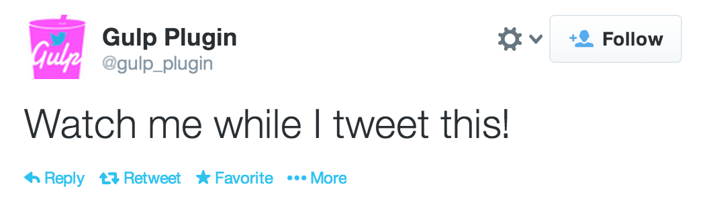

# gulp-twitter [![Build Status][travis-image]][travis-url] [![Coverage Status][coveralls-image]][coveralls-url] [![NPM version][npm-image]][npm-url]
[![Dependency Status][depstat-image]][depstat-url] [![devDependency Status][devdepstat-image]][devdepstat-url]

> [Twitter](http://www.twitter.org/) plugin for [gulp](https://github.com/wearefractal/gulp) 3.

## Usage

First, install `gulp-twitter` as a development dependency:

```shell
npm install --save-dev gulp-twitter
```

Then, add it to your `gulpfile.js`:

```javascript
var gulp = require('gulp');
var twitter = require('gulp-twitter');

// Construct `oauth` config.
var oauth = {
    consumerKey: process.env.CONSUMER_KEY,
    consumerSecret: process.env.CONSUMER_SECRET,
    accessToken: process.env.ACCESS_TOKEN,
    accessTokenSecret: process.env.ACCESS_TOKEN_SECRET
};

gulp.task('tweetie', function () {
    return gulp.src('package.json')
           .pipe(twitter(oauth, 'Watch me while I tweet this.'));
});
```

or use it as a reporter for a `lint` or `test` plugin like so

```js
var jshint = require('gulp-jshint');

gulp.task('scripts', function () {
    var message = function (file) {
        var ret = file.relative;
        if (file.jshint.success) {
            ret = ret  + ' looks good.';
        } else {
            ret = ret + ' seems off.';
        }
        return ret;
    };
    
    return gulp.src('*.js')
               .pipe(jshint())
               .pipe(twitter(oauth, message);
            
});
```

## API 

### `twitter(oauth, message)`

### oauth
Type: `Object`
Default: `{}`

OAuth credentials, i.e.

```json
{
    "consumerKey": "CONSUMER_KEY",
    "consumerSecret": "CONSUMER_SECRET",
    "accessToken": "ACCESS_TOKEN",
    "accessTokenSecret": "ACCESS_TOKEN_SECRET"
}
```

Create a [Twitter App](https://dev.twitter.com/apps/new) and get [OAuth](http://oauth.net/) credentials (if you haven’t already). Be careful, these tokens are like passwords so you should guard them carefully. For usage with [Travis CI](https://travis-ci.org/) see the [documentation on encryption keys](http://docs.travis-ci.com/user/encryption-keys/).

### message
Type: `String` or `Function`
Default: `''`

If you pass a `Function` this will be passed a `gulp-util.File Object` (see https://github.com/wearefractal/gulp-util/#new-fileobj) and should return a `String`, e.g. `function (file) {return 'gulp-tweeting ' + file.relative;}`.

## Results


## License

[MIT License](http://en.wikipedia.org/wiki/MIT_License) © [Jan Raasch](http://janraasch.com)

[npm-url]: https://npmjs.org/package/gulp-twitter
[npm-image]: https://badge.fury.io/js/gulp-twitter.png

[travis-url]: http://travis-ci.org/janraasch/gulp-twitter
[travis-image]: https://secure.travis-ci.org/janraasch/gulp-twitter.png?branch=master

[coveralls-url]: https://coveralls.io/r/janraasch/gulp-twitter
[coveralls-image]: https://coveralls.io/repos/janraasch/gulp-twitter/badge.png

[depstat-url]: https://david-dm.org/janraasch/gulp-twitter
[depstat-image]: https://david-dm.org/janraasch/gulp-twitter.png

[devdepstat-url]: https://david-dm.org/janraasch/gulp-twitter#info=devDependencies
[devdepstat-image]: https://david-dm.org/janraasch/gulp-twitter/dev-status.png
